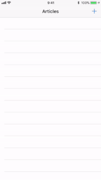
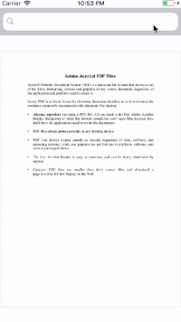
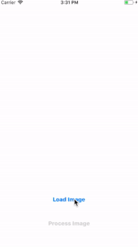
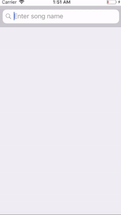
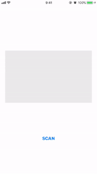

# iOS-11-Sampler
Code examples for the new features of iOS 11 written in Swift.

## Drag and Drop
**Drag and Drop** is a way to graphically move data from one application to another or even within the same application.
 
 

 
## Natural Language Processing API
**Natural Language Processing** API use machine learning to deeply understand text using features such as language identification, tokenization, lemmatization, part of speech, and named entity recognition.
 
 

 
## Persistent History Tracking
**Persistent History Tracking** targets the issue, where you have multiple contexts and extensions updating a single persistent store.
 
 

 
## PDFKit
**PDFKit** framework allows you to display and manipulate Portable Document Format (PDF) files in your applications.
 
 

 
## Vision Framework
**Vision** framework lets you apply high-performance image analysis and computer vision techniques to identify faces, detect features, and classify scenes in images and videos.
 
 

 
## MusicKit
**MusicKit** lets users play Apple Music and their local music library natively from your apps and games. 
 
 

 
## ARKit
**ARKit** helps us create the illusion that virtual objects are placed in a physical world.
 
 

 
## Advanced Animations with UIKit
**UIViewPropertyAnimator** object additions.
 
 

 
## CoreNFC
**CoreNFC** enables you to detect NFC tags and read messages that contain NDEF data on iPhone 7, iPhone 7 Plus and newer.
 
 

 
